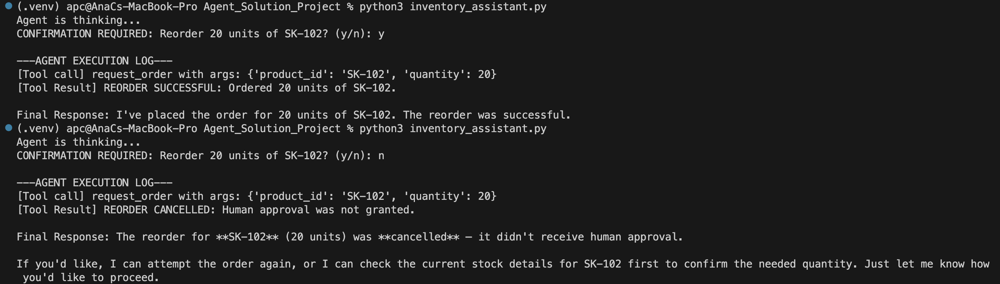

# Intelligent Customer Support Router & Responder Agent 🤖✉️

## 📌 Project Overview
This repository features the design and implementation of an automated, single-agent **Intelligent Customer Support Assistant**. Using LLM integration and structured prompt engineering, the agent automatically intercepts incoming support emails, classifies customer intent, extracts vital metadata, and generates draft responses or routes high-priority issues to the appropriate team.

*Note: The system logic, validation gates, and API interaction models utilized in this agent are directly applicable to bioinformatics pipelines—such as automating the classification of researcher queries or routing genomic data requests to specific analysis pipelines.*

---

## 🔍 The Problem
Customer support departments frequently battle high ticket volumes, leading to delayed response times and human agent burnout. Many inquiries are routine (e.g., tracking numbers, return policies, or basic troubleshooting) and do not require manual human handling. This project addresses this operational bottleneck by automating the triage and initial response phase with a highly reliable AI agent.

---

## 🏗️ System Architecture & Approach
The agent is designed as a structured, sequential workflow:
1. **Input Ingestion:** The agent accepts a raw support query or email.
2. **Intent & Sentiment Classification:** Uses an LLM with strict system prompting to categorize the query (e.g., Billing, Technical Support, Returns, or Feedback) and detect customer frustration.
3. **Structured Data Extraction:** Automatically extracts key variables like Order IDs, tracking numbers, or error codes.
4. **Automated Response Generation:** Generates a personalized, context-aware email draft using pre-approved knowledge templates.
5. **Human Escalation Gate:** If the query is classified as high-urgency, Billing, or contains complex issues, the agent flags it for immediate human review.

---

## 🛠️ Tools & Technologies
* **Programming Language:** Python 3
* **AI Integration:** OpenAI API / Anthropic API (via Python SDK)
* **Configuration & Security:** Python-dotenv (API keys loaded via environment variables; `.env` is secure and excluded via `.gitignore`)
* **Environment:** Flat Python script execution with modular utility files
* **Version Control:** Git & GitHub

---

## 👥 My Individual Contribution
* **Project Type:** Individual Portfolio Project  
* **My Role:** **Lead AI Engineer**  

As the sole developer of this project, I owned the entire development cycle, including:
* **Agent System Design:** Designed the decision-making flow and classification matrix.
* **Prompt Engineering:** Formulated robust system prompts with strict rules, boundaries, and expected output formats to prevent model hallucinations.
* **Security & Configuration:** Configured secure API connections, ensuring sensitive credentials are never committed to the public repository.
* **Testing:** Built component-level tests to ensure classification accuracy across diverse customer inputs.

---

## 📈 Key Results & Outcomes
* **Zero Latency Triage:** Automated email classification, routing tickets to the correct department instantly upon arrival.
* **Consistent Quality:** Ensured all automated draft responses strictly adhere to company guidelines and maintain a professional, helpful tone.
* **API Security:** Successfully built a production-grade secure application setup using a standard local configuration pattern.

---

## 🖼️ Project Evidence & Visualizations 
* **System Environment Setup:** See [`Project README`](./README) for required configuration.
Creating a modular Python codebase so the agent can be easily adapted for future applications (such as automated scientific database queries).
* **Visualizations:** 
  
  
